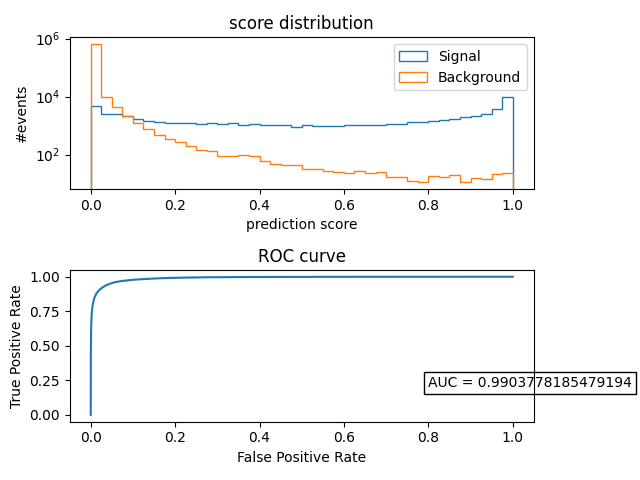

# pDNN

```bash
├── array_utils.py
├── config.ini
├── data
│   └── merged
├── dataset.py
├── LICENSE
├── main.py
├── models
│   ├── __init__.py
│   ├── model.py
├── README.md
├── requirements.txt
├── saved_models
├── train.py
└── utils.py
```

- array_utils : utility functions to manage input arrays
- config.ini : has the config params
- data : contains root files
- dataset : function to get dataset class
- main : contains driver code
- model : contains dNN model
- train : contains training class
- utils : contains util functions for i/o and training

### To install required packages :
```bash
pip install -r requirements.txt
```

### Dataset: :
``` bash
- add root files to {root_path}/merged/{campaigns}/
```

### To train :
```bash
python main.py --num_gpus (num_gpus) --config (path to config file)
```

### Current results on the ZPR channel

